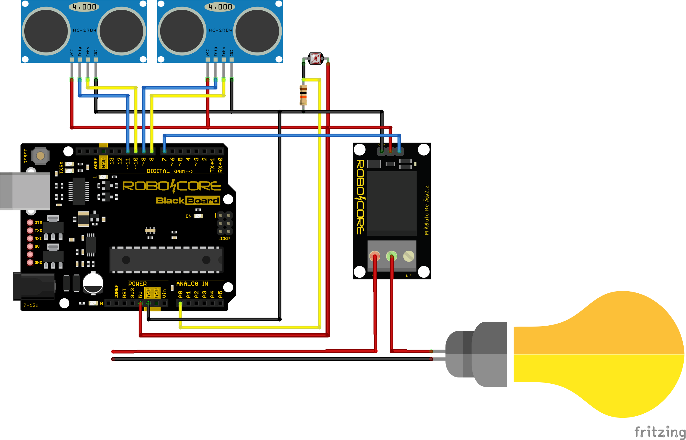

# Projeto Arduino

 

## Sensor de Movimento para acender uma luz

Utilizando os sesores de movimento, neste caso 2 sensores, para fazer o acionamento de um relé que acende uma luz. 
Os sensores foram dispostos em cantos separados do ambiente, um no portão de entrada, e outro no porta para dentro de casa, para que idempedentemete, se eu estiver entrando para dentro de casa, ou saindo, a luz ficará ligada nesse trajeto por um tempo determinado

 

### Materiais:
- Arduino Uno (Modelo fabricado pela RoboCore: Blackboard)
- Biblioteca para arduino: NewPing
- Sensor LDR
- Sensor Ultrassonico
- Modulo Relé 

Utilizando esses materiais, foi desenvolvido um codigo onde verifica a quantidade de luz no local, e determina se todo o projeto vai funcionar ou não. Após a verificação da luz no local, o codigo entra em um loop, verificando cada sensor ultrassonico, e se caso ele detectar alguma movimentação, ele aciona o relé que deixa a energia passar para uma lâmpada, e após um determinado tempo, interrompe a energia para a lâmpada, e volta ao seu loop de detcção de movimento com os sensores

## Esquemático da ligação entre os componetes

*Foi utilizado apenas 2 sensores ultrassonicos neste projeto, mas é possivel adicionar quantos quiser, apenas mudandos os valores nas variaves*
 

 

### Ideias para o futuro

Futuramente, a ideia para fazer atualizações neste projeto é mudar o modelo do arduino UNO para um arduino mini ou nano, pelo custo beneficio e seu pequeno tamanho. Outra implementação que gostaria de fazer, é adcionar um modulo Wi-fi ESP8266, para poder fazer o acionamento da luz, via algum app ou pagina web, e também monitorar o acionamento e movimentação pelos sensores.

 

### Sugestões

Caso você tenha sugestões e ideias para implementar/acrescentar em meu projeto, por favor entre em contato, eu adoraria discutir e ouvir!

 
 

©Romerozito

Itirapina/SP - 2021

